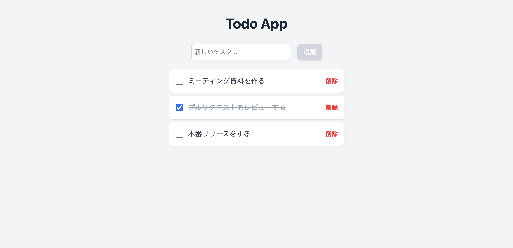

# ステップ7-2: tailwindcssの実装

## tailwindcssを使って見た目を整える

### src/routes/+page.svelte を編集する

```svelte
<script lang="ts">
  import { onMount } from 'svelte';

  type Todo = {
    text: string;
    done: boolean;
  };

  let newTodo: string = $state('');
  let todos = $state([] as Todo[]);
  let isInitialized: boolean = $state(false);

  function addTodo() {
    if (newTodo.trim()) {
      todos.push({ text: newTodo, done: false });
      newTodo = '';
    }
  };

  function deleteTodo(index: number) {
    todos.splice(index, 1);
  };

  onMount(() => {
    // ブラウザ上で動いてる時のみ。SSR中(Node.js実行環境)は undefined
    if (typeof window !== 'undefined') {
      try {
        // ローカルストレージから TODO JSON文字列を取得
        const savedTodos = localStorage.getItem('todos');
        if (savedTodos) {
          todos = JSON.parse(savedTodos); // JSON文字列を TODO オブジェクトに変換
        }
      } catch (e) {
        console.error('Failed to load todos from localStorage:', e);
      } finally {
        isInitialized = true; // 初期化完了
      }
    }
  });

  $effect(() => {
    if (isInitialized && typeof window !== 'undefined') {
      try {
        // ローカルストレージへTODOオブジェクトをJSON文字列で保存
        localStorage.setItem('todos', JSON.stringify(todos));
      } catch (e) {
        console.error('Failed to save todos to localStorage:', e);
      }
    }
  });
</script>

<main class="min-h-screen bg-gray-100 flex flex-col items-center py-10">
  <h1 class="text-4xl font-bold text-gray-800 mb-8">Todo App</h1>

  <div class="flex items-center gap-4 mb-6">
    <input
      type="text"
      placeholder="新しいタスク..."
      bind:value={newTodo}
      onkeydown={(e) => {
        if (e.key === 'Enter' && !e.isComposing) {
          addTodo();
        }
      }}
      class="w-64 p-2 border bg-white border-gray-300 rounded-lg focus:outline-none focus:ring-2 focus:ring-blue-500"
    />
    <button
      onclick={addTodo}
      disabled={!newTodo.trim()}
      class="px-4 py-2 bg-blue-500 text-white font-semibold rounded-lg shadow-md hover:bg-blue-600 cursor-pointer disabled:bg-gray-300 disabled:cursor-not-allowed"
    >
      追加
    </button>
  </div>

  <ul class="w-full max-w-md">
    {#each todos as todo, i}
      <li class="flex items-center justify-between bg-white p-4 rounded-lg shadow-sm mb-2">
        <div class="flex items-center gap-3">
          <input
            type="checkbox"
            bind:checked={todo.done}
            class="h-5 w-5 text-blue-500 focus:ring-blue-500 border-gray-300 rounded"
          />
          <span class={`text-lg ${todo.done ? 'line-through text-gray-400' : 'text-gray-700'}`}>
            {todo.text}
          </span>
        </div>
        <button
          onclick={() => deleteTodo(i)}
          class="text-red-500 font-semibold cursor-pointer hover:underline"
        >
          削除
        </button>
      </li>
    {/each}
  </ul>
</main>
```

## 完成



tailwindcssを使用しているので `style` タグなしで綺麗にデザインしたTodoアプリが完成しました🎉

## [STEP8へ](step8.md)
