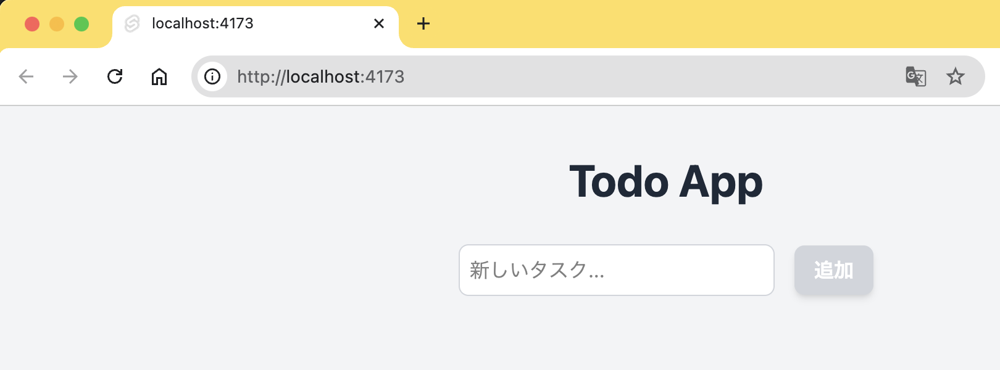
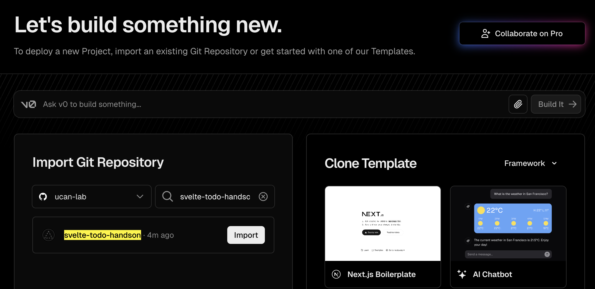
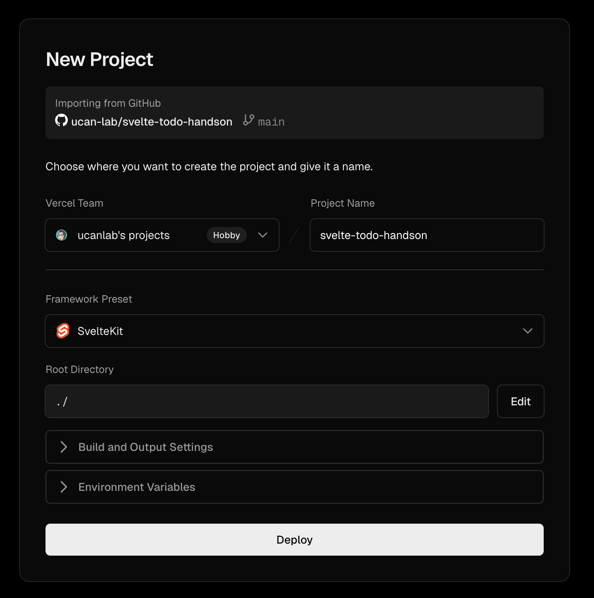
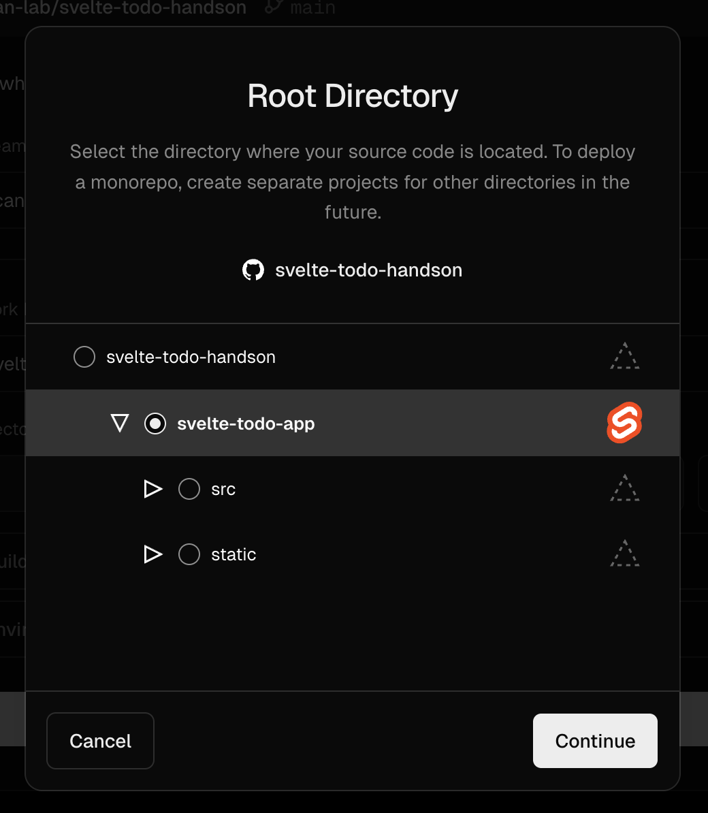
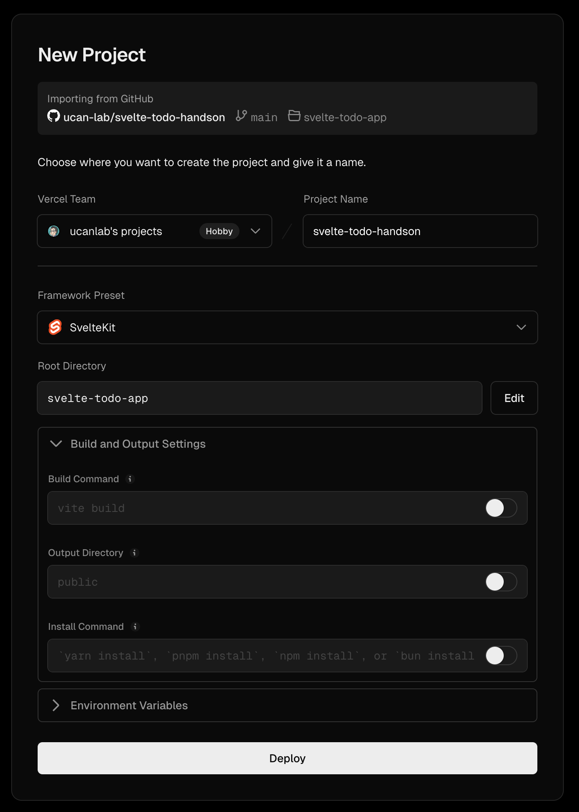
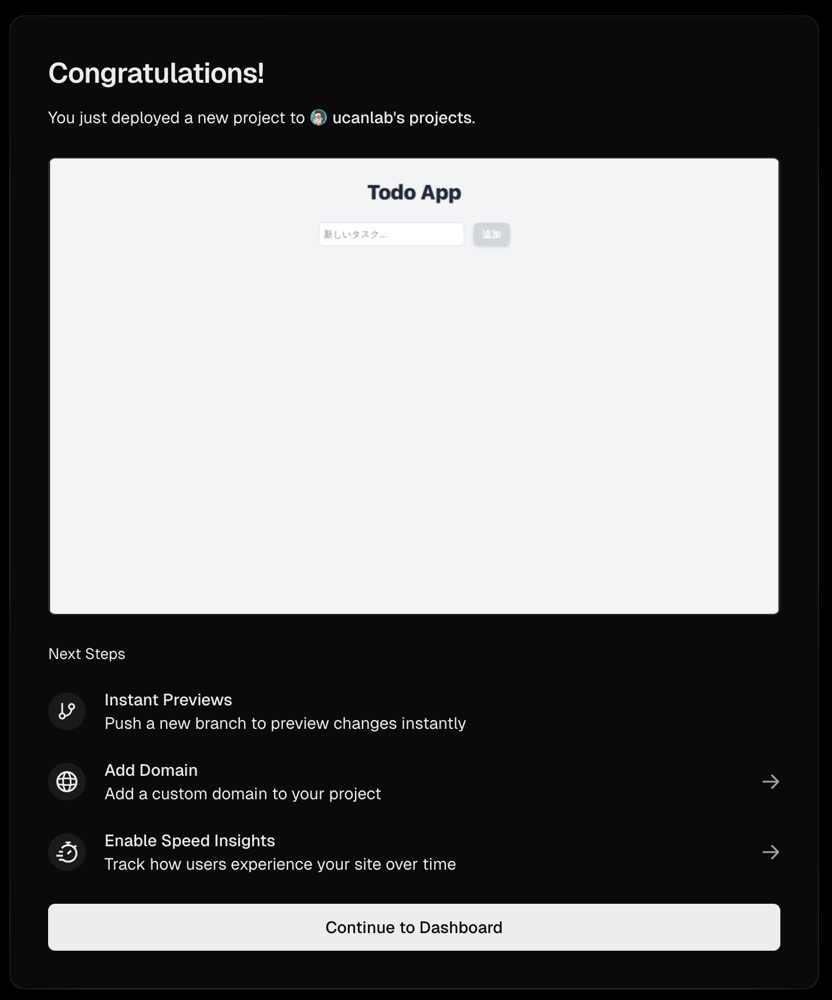
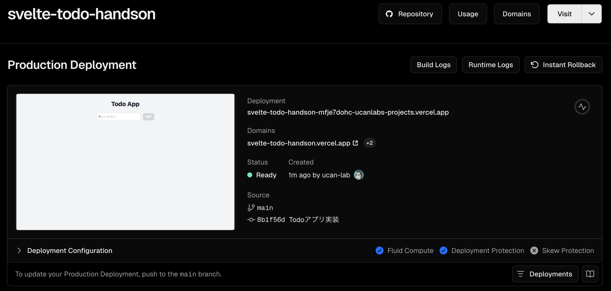
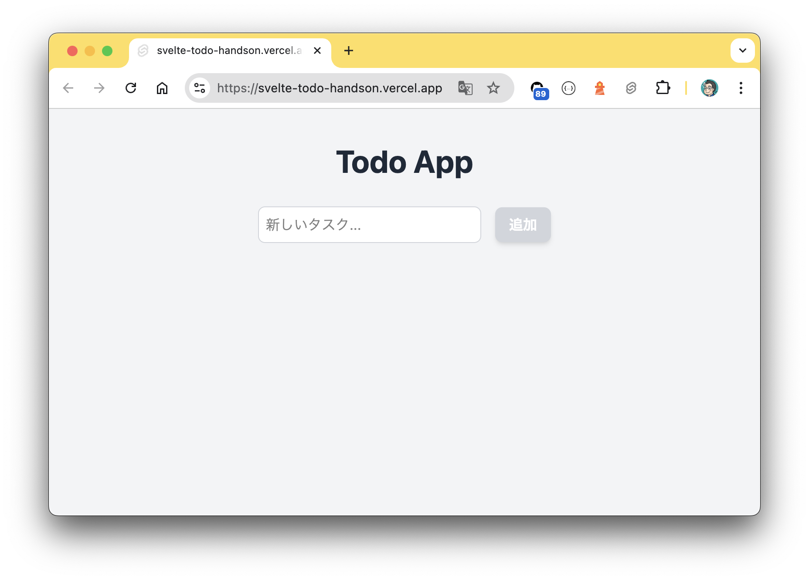

# ステップ8: デプロイ

## TodoアプリをVercelにデプロイする

https://vercel.com

Vercelは、フロントエンドに特化したクラウドホスティングサービスです。

- アカウント登録が必要です
- GitHubアカウントと連携可能です

## GitHubへpushする

GitHubでリポジトリを用意して下さい

```bash
$ git push origin main
```

## Vercel用のアダプタをインストール

```bash
$ npm install -D @sveltejs/adapter-vercel
```

## デプロイ設定

### svelte.config.js を編集する

```diff
-import adapter from '@sveltejs/adapter-auto';
+import { vitePreprocess } from '@sveltejs/vite-plugin-svelte';

/** @type {import('@sveltejs/kit').Config} */
const config = {
  // Consult https://svelte.dev/docs/kit/integrations
  // for more information about preprocessors
  preprocess: vitePreprocess(),

  kit: {
    // adapter-auto only supports some environments, see https://svelte.dev/docs/kit/adapter-auto for a list.
    // If your environment is not supported, or you settled on a specific environment, switch out the adapter.
    // See https://svelte.dev/docs/kit/adapters for more information about adapters.
    adapter: adapter()
  }
};

export default config;
```

## ローカルで動作確認

```bash
$ npm run build
$ npm run preview
```

http://localhost:4173



## VercelでGitHubリポジトリをインポート

https://vercel.com/new?onboarding=true

TodoアプリのGitHubリポジトリをインポートします。



## Project Nameを設定してください



## Root Directoryを設定してください



`package.json` が入っているディレクトリを指定します。
リポジトリ直下に package.json がある方はデフォルトのままでokです。



ビルドオプションは変更しなくてokです。
「Deploy」ボタンを押下します。



デプロイ完了です🎉
ダッシュボードへ遷移します。



ダッシュボードからドメインをクリックするとデプロイしたTodoアプリを表示できます。


